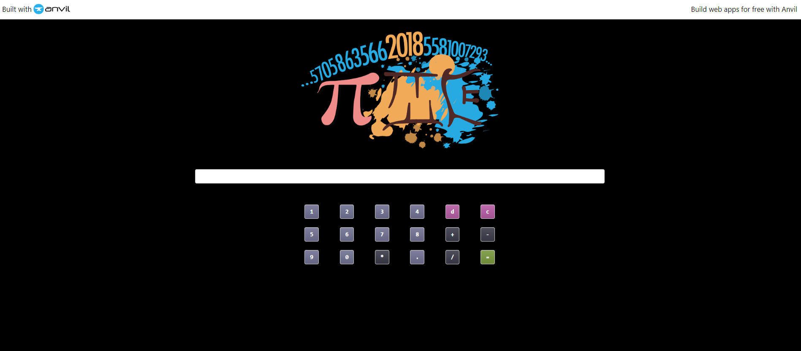

# Simple Calculator GUI Web Application with Anvil

 
    <b> LIVE SITE : https://simplecalculator888.anvil.app </b>
     
     

This is a `simple calculator` build with `Python` & `Anvil`. Anvil is a free Python-based drag-and-drop `web app builder`. Here we wrote Python on the front-end and back-end to make it all work.With this calculator we can do some simple math operation. It has also a nice `GUI`. 

 

 
    
     
     
    <b> In this project we focus on pure Python web applications  </b>
     

Table of Contents:

- [Features](#features)
- [Contributing](#contributing)
- [Follow Me](#follow-me)

## Features
- `Addition`, `Multiplication`, `Substraction`, `Division`.
- Has button `c` for `clear` everything
- Has button `d` for `delete` numbers 
- Clean Keyboard & `Square buttons` with multiple colour effects.
- Clean & Clear GUI for minimal experience

## App Interface

## Contributing
1. Fork this Repository
2. Create a new branch for your feature: `git checkout -b feature/your-feature.neame`
3. Make the necessary change and commit them: `git commit -m "Add Your Commit Here"`
4. Push the change to your fork: `git push origin feature/your-feature.name`
5. Create a Pull request on the original repository

## Follow Me

Check out my social handle and follow me on [Twitter](https://twitter.com/root__secure), [linkedin](https://www.linkedin.com/in/injamul-hasan-163414236/) , [Instagram](https://www.instagram.com/root__secure/) more help, ideas, and discussions.

### Developed for learning purposes. New python learners can easlily understand how calculator works by this small and simple app .
